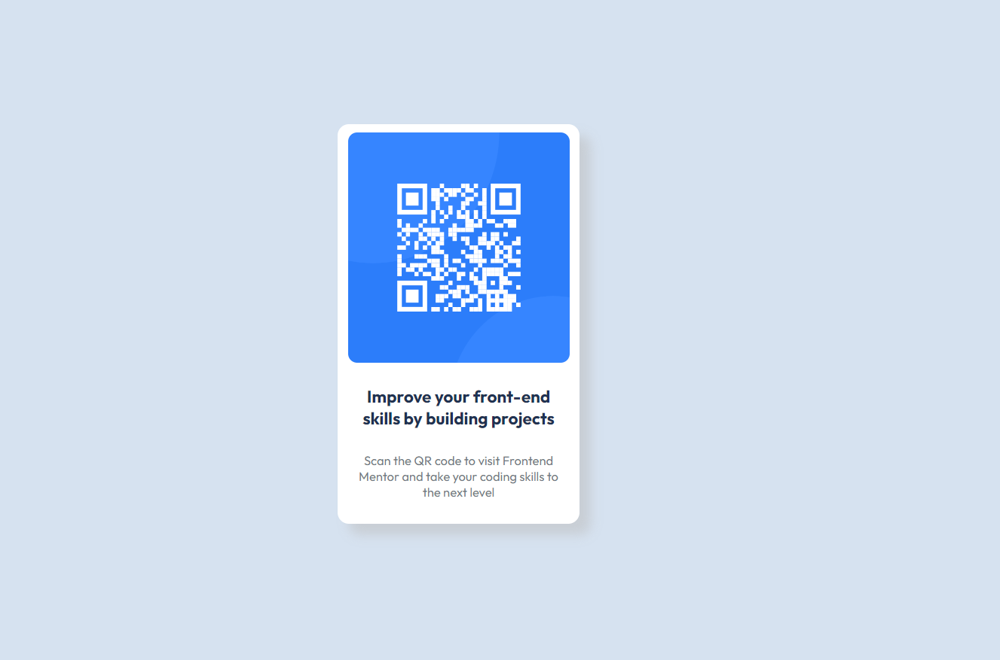

# Frontend Mentor - QR code component solution

This is a solution to the [QR code component challenge on Frontend Mentor](https://www.frontendmentor.io/challenges/qr-code-component-iux_sIO_H). Frontend Mentor challenges help you improve your coding skills by building realistic projects.

## Table of contents

-  [Overview](#overview)
   -  [Screenshot](#screenshot)
   -  [Links](#links)
-  [My process](#my-process)
   -  [Built with](#built-with)
   -  [What I learned](#what-i-learned)
   -  [Continued development](#continued-development)
   -  [Useful resources](#useful-resources)
-  [Author](#author)
-  [Acknowledgments](#acknowledgments)

## Overview

### Screenshot



### Links

-  Solution URL: [Add solution URL here](https://github.com/Rengrouze/qr-code-component-main)
-  Live Site URL: [Add live site URL here](https://rengrouze.github.io/qr-code-component-main/)

## My process

### Built with

-  Semantic HTML5 markup
-  CSS custom properties
-  Flexbox

### What I learned

I didn't learned anything but i had a pretty good reminder of basic HMTL5 and CSS3 and how flexbox work, although it makes me think about the way i prefer encapsulating images in a div box, it allows me to add border or other style easily, i wonder if there is another way to it efficiently

```html
<div class="imgframe">
   
</div>
```

### Continued development

For now, nothing, it is just a plain display of a QR code, maybe a little change to the design could be nice, it could be more fitted to bigger screen, i should take inspiration from the google chromecast UI

### Useful resources

-  [for classes properties ](https://www.w3schools.com) - when working with basic html and css, it's the best ressource to get

## Author

-  Website - [Rengrouze A.K.A me](https://github.com/Rengrouze)
-  Frontend Mentor - [@Rengrouze](https://www.frontendmentor.io/profile/Rengrouze)
